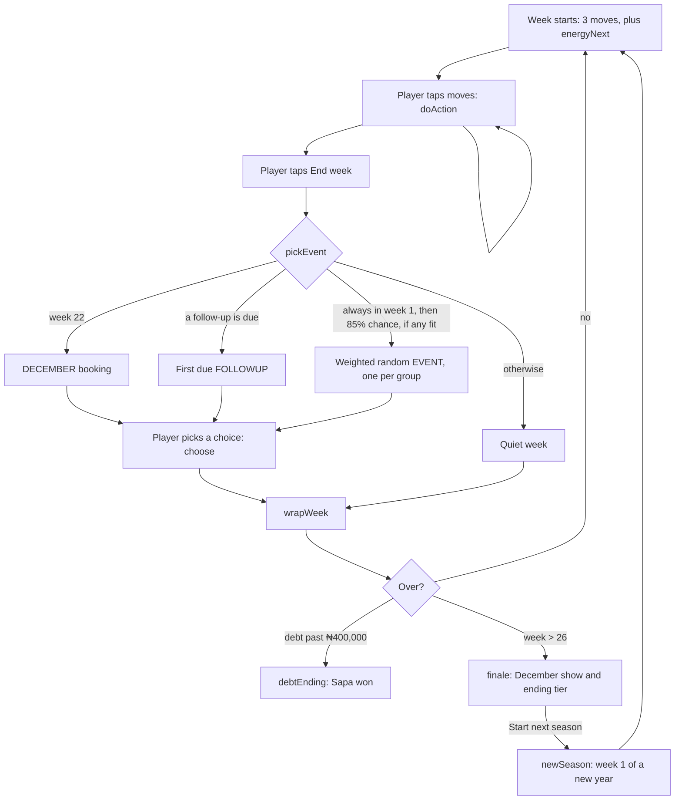

# Architecture

How The Next Lagos Star is built, how a week runs through the code, and what can break if you change it.

## The short version

- The game is two files that sit side by side: `index.html` (styles, content, rules and interface) and `stories.js` (the story cards). There is no framework, no build step and no dependencies apart from two Google Fonts. Opening `index.html` from disk still works. See [ADR 0002](adr/0002-single-html-file-no-framework.md) and [ADR 0009](adr/0009-story-data-file.md).
- Netlify serves the repo root as a static site. Every push to `main` goes live. See [ADR 0003](adr/0003-static-hosting-on-netlify.md).
- Each player's game is saved in their own browser's `localStorage`. There is no server. See [ADR 0004](adr/0004-saves-in-local-storage.md).
- `simulate.js` loads the same scripts, through `load-game.js`, and plays thousands of games in Node to check balance. See [ADR 0006](adr/0006-headless-simulator-for-balance.md).

## Layout of the script

`index.html` loads two scripts, in this order: `<script src="stories.js">`, then its own `<script>` block. They share one set of names, the way a page's classic scripts do.

`stories.js` only defines the story cards. It runs first, so a card may not call anything while the file loads: everything it uses (`by`, `chk`, `odds`, `rel`, `R`, `val` and the rest) is called later, inside the card's functions, when the game script already exists. That is also why `CAREERS` can point straight at `DECEMBER` and `PREMIERES`.

| Part of `stories.js` | What is in it | Touches the page? |
| --- | --- | --- |
| Template | A commented template card for writers | No |
| Cast | `CAST`, every recurring character, and `anySong`, a helper only stories use | No |
| Stories | `EVENTS`, `FOLLOWUPS`, `DECEMBER` (music's week-22 booking) and `PREMIERES` (the actor's) | No |

The `<script>` block in `index.html` then runs top to bottom in this order.

| Part | What is in it | Touches the page? |
| --- | --- | --- |
| Helpers | `TOTAL_WEEKS`, `SAVE_KEY`, the random helpers `R` (seedable with `R.seed(n)`, using `mulberry32`), `clamp`, `val`, money and fan formatting | No |
| Content | `TIER_MINS`, `tierOf`, `nextTier`, `SLOGANS`, `OPENERS`, `SONG_TITLES`, `STAGE_NAMES`, `songTitle`, `qWord` | No |
| Money and checks | `takeHome` (who takes a cut), `chk` and `odds` (stat checks), `rel` and `relWord` (relationships), `REACH` and `apply` (applies effects) | No |
| Weekly moves | `venue`, the `ACTIONS` list, `movesOf`, `nextGoal`, `actionState`, `doAction` | No |
| Stories | `forCareer`, `pickEvent`, `choiceState`, `choose`. The cards are in `stories.js` | No |
| End of week | `streamGross`, `PEOPLE_COST`, `wrapWeek` | No |
| Careers | `CAREERS`, `careerOf`, and each career's own functions, such as `musicVenue`, `musicGoal` and `musicFinale` | No |
| Endings | `tally`, `debtEnding`, `finale`, `newGame` | No |
| Seasons and saves | `YEAR`, `newSeason` (starts the next season), `migrate` (upgrades an older save) | No |
| Interface | everything inside `if (typeof document !== 'undefined')` | Yes |

Everything above the interface block, and all of `stories.js`, must stay free of `document`, `window` and `localStorage`. That rule is what lets `simulate.js` run the rules in Node.

## Game state

`newGame(name, backgroundId, careerId)` returns one plain object. `careerId` defaults to `'music'`. Everything about a game lives in it, and it is saved to `localStorage` as JSON after every change.

| Field | Meaning |
| --- | --- |
| `v` | Save format version. Currently `2` |
| `name`, `career`, `bg` | Stage name, career id and starting background id. A save without `career` is a music save |
| `season`, `history` | The season, from 1, and one entry per finished season: `{ season, title, rank, fans, money }` |
| `week` | Current week of the season, 1 to 26. Becomes 27 after the last `wrapWeek` |
| `energy`, `energyNext` | Moves left this week, and the change to next week's moves |
| `money`, `fans` | Cash in naira (can go negative) and fan count |
| `skill`, `hype`, `cred`, `links` | Stats from 0 to 100 |
| `rent` | Rent due every fourth week. Starts at ₦100,000 |
| `vault`, `songs` | Recorded songs not yet out, and released songs. Each is `{ title, q }`, released ones also have `week`. A song from an earlier season has a week of 0 or less (see below) |
| `flags` | Anything a story needs to remember, such as `manager`, `investor`, `signed`, `jingle`, `dec`. A number flag of 26 or less is a week |
| `rel` | How each `CAST` character feels about you, by id, from −10 to 10. Set by the `rel` effect, read with `rel(s, id)`. Saves from before relationships have no `rel`: `rel(s, id)` reads 0 and `apply` creates it on the first write. The game screen's details panel lists everyone in it under People, as Enemy, Cold, Neutral, Warm or Ally |
| `seen` | Ids of stories already shown. Each story appears once per season; follow-ups and stories marked `once: 'career'` once per career |
| `promoWeek`, `lastRelease`, `recoup` | Promo limiter, release fatigue, and the label advance still to pay back |
| `log`, `opener`, `slogan` | Text shown on the game screen this week |
| `over` | `null` while playing, then the ending object from `finale` or `debtEnding` |

Changing the shape of this object can break saved games. If a change is not backwards compatible, bump `v` and add a step to `migrate(save)`, which `load()` calls on whatever is in `localStorage`. `migrate` turns a version 1 save into version 2 by adding `season: 1` and an empty `history`, gives a save without `career` the music career and one without `rel` an empty `rel`, leaves a version 2 save as it is, and returns `null` for anything else, which `load()` then ignores. The storage key is still `next-lagos-star-v1`. `node test-saves.js` loads real version 1 saves, migrates them and plays them on, and runs on every pull request. A field that old saves lack and `migrate` does not fill must be optional in the code.

### Seasons

`newSeason(s)` starts the next season after a December ending ([ADR 0010](adr/0010-seasons-carry-over.md)). It adds the season to `history`, keeps 80% of fans, sets hype to 0, and keeps money, stats, deals, the vault, songs, flags, relationships (`rel`) and rent. Weeks stored in the state (number flags of 26 or less, each song's `week`, and `lastRelease`) move back by `YEAR`, 27 weeks, so "weeks since" keeps counting across the January break, which counts as one week. A follow-up due in December arrives in January. `seen` keeps follow-ups and `once: 'career'` stories and forgets the rest, and the December booking flag `dec` is cleared. A story with `fromSeason: 2` only appears from the second season.

From the second season, `apply` scales every fan gain by `REACH ÷ (REACH + fans)`, with `REACH` at 50,000, so growth levels off instead of compounding without limit. Season 1 never uses it.

## Careers

The game is built for several careers in one city ([ADR 0008](adr/0008-careers-share-one-engine.md)). The week, money, stats, stat checks, deals, story picking, the cast and saves are shared. Each career in `CAREERS` brings the rest:

| Key | What it is | Music | Actor |
| --- | --- | --- | --- |
| `name`, `desc`, `lede`, `opener`, `how` | Title screen and first-week text | "Music artist", the one-room in Yaba | "Nollywood actor", the same room |
| `backgrounds` | Starting backgrounds, with starting stats | Choir kid, street freestyler, Island kid | Church drama star, skit maker, Theatre Arts graduate |
| `moves` | The career's moves, in screen order, shared ones included | Rehearse, record, release, … | Rehearse lines, audition, shoot a role, … |
| `openers`, `slogans` | The week's opening line and bus slogan, drawn at random | `OPENERS`, `SLOGANS` | `ACTOR_OPENERS`, slogans with one changed |
| `tiers` | Names for the five fan tiers in `TIER_MINS` | Upcoming artist up to Lagos star | Extra up to Nollywood star |
| `verdicts` | The ending line for each tier, top first | | |
| `venue(s)` | The venue ladder for shows and promo prices | Open mic in Yaba up to your concert in Ikeja | Church drama in Ebute Metta up to the Muson Centre |
| `goal(s)` | The "Next:" line on the game screen | `musicGoal` | `actorGoal` |
| `income` | Weekly income: a label, `gross(s)` and the line shown before the first release | Streams, from `streamGross` | Streaming licences, half of `streamGross` |
| `december` | The week 22 booking card | `DECEMBER` | `PREMIERES` |
| `finaleShow(s, booking)` | The December show text and its effects | `musicFinale` | `actorFinale` |
| `debtVerdict` | The ending line when Sapa wins | The bank job in Marina | The same job, with impressions |
| `words` | Words that shared screens and endings use: the income cuts are taken from, the shelf labels, the tally rows, the sellout line | "music income", "Your songs, deals and people" | "acting income", "Your roles, deals and people" |

Moves in `ACTIONS` with `careers: ['music']` belong to that career; untagged moves (post content, show face, side hustle) are shared, and word themselves for each career. Stories work the same way. Text that differs by career uses `by(s, {music: ..., actor: ...})`, which falls back to the music version. A story's `title`, `who`, `text` and `choices` can all be functions of `s`. `putOut(s)` is the shared release maths, used by music releases and actor shoots. The game state keeps released and unreleased work in `songs` and `vault` for every career.

The title screen asks for the career only when there is more than one. To add a career, add an entry to `CAREERS`, tag its moves and stories, and give `simulate.js` a sensible player for it.

## How a week runs

`wrapWeek` does the weekly bookkeeping in this order:

1. The career's weekly income, `CAREERS[id].income`. For music that is streams, from `streamGross`: `fans × 1.5 × min(1, w ÷ 3)`, where `w` adds up each released song's weight `max(0.1, 0.9 ^ weeks since release) × (0.5 + quality ÷ 100)`. Paid through `takeHome`.
2. Food, data and transport: −₦12,000.
3. Your people: `PEOPLE_COST` by tier, from ₦15,000 a week at Buzzing.
4. Rent on every fourth week.
5. Aunty Bisi adds 2 links a week if she manages you.
6. Hype cools: `round(hype × 0.8 − 2)`.
7. If cash is below zero: 10% interest on the debt, −3 street cred, −2 links.
8. Next week: moves reset to `max(1, 3 + energyNext)`, new opener and slogan.
9. Cash below −₦400,000 ends the game with `debtEnding`.

## Who takes a cut

`takeHome(s, gross)` is applied to all music income (`earn` effects and streams). It takes cuts in this order:

1. Gbedu Empire, bad contract (`flags.signed`): pays back the advance (`recoup`) first, then keeps 70%.
2. Gbedu Empire, negotiated contract (`flags.signedGood`): keeps 20%.
3. Aunty Bisi, manager (`flags.manager`): keeps 20%.
4. Chad, investor (`flags.investor`): keeps 30%.

`money` effects skip `takeHome`. Use `earn` for music income and `money` for anything else.

## Stat checks

`chk(s, stat, need)` passes when `stat + (8 if managed) + a random number from −6 to 6 ≥ need`. `odds(s, stat, need)` writes the hint the player sees: "Should work." when the gap is 6 or more, "Could go either way." within 6, and "Long shot." below that.

## Interface

The interface keeps a small `ui` object (`screen`, `sheet`, `prev`, `fresh`, `confirmRestart`) and redraws with `innerHTML` on every change. There are three screens (title, game, end) and one bottom sheet (`#sheet`) that shows a story, then the result and the end-of-week summary. Clicks are handled in one listener on `document` using `data-act`, `data-choice` and `data-cmd` attributes.

While the sheet is open, the rest of the page is `inert`, so keyboard focus stays inside the sheet. When it closes, `sheetFocus` moves focus to what changed: the week's opening line or the ending title. Keep both behaviours when changing the sheet. Buttons and links are at least 44px tall, and `prefers-reduced-motion` turns every animation off. The pages pass an axe-core audit (WCAG 2.1 AA) in light and dark mode.

## What the simulator depends on

The tools load the game through `load-game.js`. `loadGame(names)` reads `index.html`, takes its `<script>` tags in page order (the file named by `<script src="stories.js">`, then the inline game script), joins them, evaluates them with `new Function`, and returns the names asked for. The interface block skips itself because Node has no `document`. `simulate.js` reads these names:

`newGame`, `newSeason`, `doAction`, `actionState`, `pickEvent`, `choose`, `choiceState`, `wrapWeek`, `finale`, `val`, `R`, `ACTIONS`, `CAREERS`, `TOTAL_WEEKS`, `EVENTS`, `FOLLOWUPS`

Renaming any of them, or using the page above the interface block or in `stories.js`, will break the simulator. The loader only understands a plain `<script>` or a `<script src="…">` that names a local file, so keep any new script tag in one of those two forms. Run `node simulate.js 200` after any change to the rules.

`lint-stories.js` loads the game the same way and reads `newGame`, `val`, `EVENTS`, `FOLLOWUPS`, `CAREERS`, `STAGE_NAMES` and `CAST`. `test-saves.js` reads the same names as the simulator, plus `migrate`. `.claude/skills/write-story/try-story.js` reads `newGame`, `choose`, `choiceState`, `val`, `EVENTS`, `FOLLOWUPS`, `DECEMBER`, `CAREERS` and `CAST`. The first three run on every pull request in `.github/workflows/check.yml`.

## Deploys

| Event | Result |
| --- | --- |
| Push or merge to `main` | Netlify deploys to https://next-lagos-star.netlify.app in a few seconds |
| Pull request | Netlify builds a deploy preview, if previews are on for the project |

Netlify publishes the whole repo root, but `_redirects` returns 404 for everything except the game, `index.html` and `stories.js`: the docs, tools (including `load-game.js`), baseline and repo settings. When you add a new file or folder at the root that players don't need, add a line for it to `_redirects`.

## Player feedback

The end screen, and a "Send feedback" link in the game's footer, show a short playtest form (`feedbackHtml` and `sendFeedback` in the interface block). It posts to `/` as a [Netlify Form](https://docs.netlify.com/forms/setup/) named `feedback`. Netlify only accepts the post because of the hidden copy of the form near the top of `<body>`, which it reads at deploy time. If you add, rename or remove a field, change both, or Netlify drops the field.

| Field | Filled by |
| --- | --- |
| `duration`, `confused`, `favourite`, `again`, `anything` | The player. All optional, but at least one is needed to send |
| `ending`, `background`, `week`, `fans` | The game, automatically |
| `company` | Nobody. A honeypot field: bots fill it and Netlify discards those posts |

The form never sends the player's stage name. Free text can still contain anything a player types. Read submissions in Netlify under the `next-lagos-star` project, then Forms, then `feedback`. Form detection is enabled for the project.
