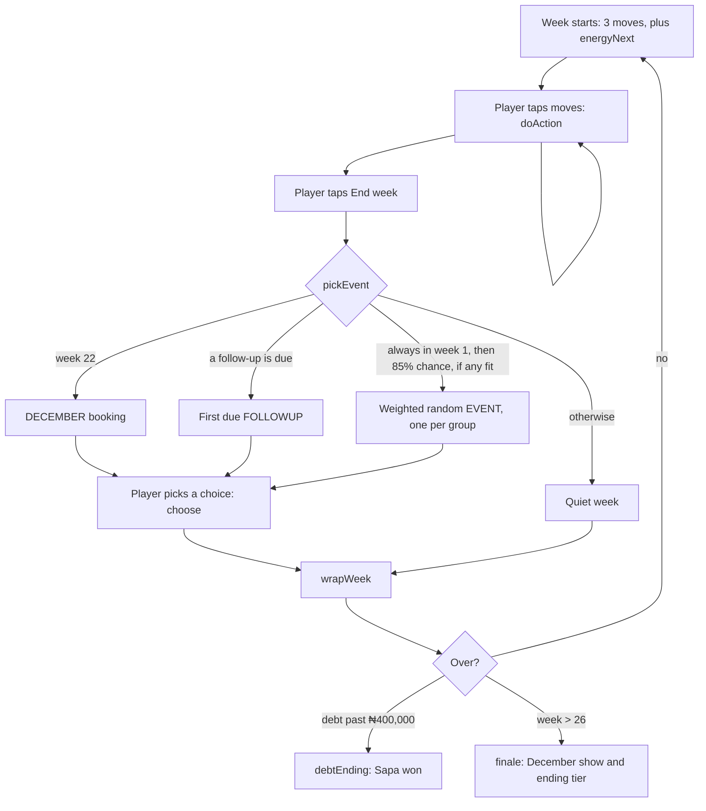

# Architecture

How The Next Lagos Star is built, how a week runs through the code, and what can break if you change it.

## The short version

- The whole game is one file, `index.html`: styles, content, rules and interface. There is no framework, no build step and no dependencies apart from two Google Fonts. See [ADR 0002](adr/0002-single-html-file-no-framework.md).
- Netlify serves the repo root as a static site. Every push to `main` goes live. See [ADR 0003](adr/0003-static-hosting-on-netlify.md).
- Each player's game is saved in their own browser's `localStorage`. There is no server. See [ADR 0004](adr/0004-saves-in-local-storage.md).
- `simulate.js` loads the same script out of `index.html` and plays thousands of games in Node to check balance. See [ADR 0006](adr/0006-headless-simulator-for-balance.md).

## Layout of the script

The `` block with a regex and evaluates it with `new Function`, then reads these names:

`newGame`, `doAction`, `actionState`, `pickEvent`, `choose`, `choiceState`, `wrapWeek`, `finale`, `val`, `R`, `ACTIONS`, `BACKGROUNDS`, `TOTAL_WEEKS`

Renaming any of them, adding a `<script>` block before the game script, or using the page above the interface block will break the simulator. Run `node simulate.js 200` after any change to the rules.

`lint-stories.js` loads the script the same way and reads `newGame`, `val`, `EVENTS`, `FOLLOWUPS`, `DECEMBER`, `STAGE_NAMES` and `BACKGROUNDS`. Both run on every pull request in `.github/workflows/check.yml`.

## Deploys

| Event | Result |
| --- | --- |
| Push or merge to `main` | Netlify deploys to https://next-lagos-star.netlify.app in a few seconds |
| Pull request | Netlify builds a deploy preview, if previews are on for the project |

Netlify publishes the whole repo root, so `README.md`, `simulate.js` and `docs/` are public too. The repo is public, so nothing secret is exposed, but see the tooling epic for tidying this.
