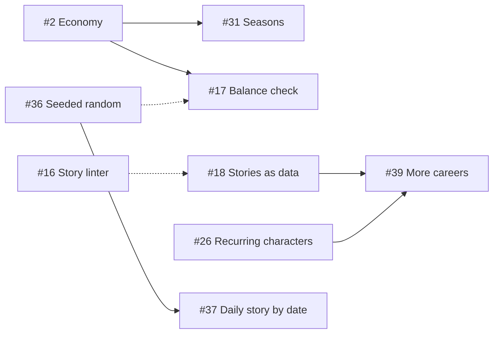

# Roadmap

The epics for The Next Lagos Star, in priority order. Each epic is a GitHub issue labelled `epic`, with its tasks as sub-issues. GitHub shows progress on each epic as sub-issues close.

All epics: [issues labelled `epic`](https://github.com/tiwadara/lagos-superstar/issues?q=is%3Aissue+label%3Aepic).

## Now

| Epic | Goal | Tasks |
| --- | --- | --- |
| [#7 Ready for players](https://github.com/tiwadara/lagos-superstar/issues/7) | Fix known rough edges, check accessibility, run a first playtest with a feedback form | [#8](https://github.com/tiwadara/lagos-superstar/issues/8) [#9](https://github.com/tiwadara/lagos-superstar/issues/9) [#10](https://github.com/tiwadara/lagos-superstar/issues/10) [#11](https://github.com/tiwadara/lagos-superstar/issues/11) [#12](https://github.com/tiwadara/lagos-superstar/issues/12) [#13](https://github.com/tiwadara/lagos-superstar/issues/13) |
| [#2 Economy and balance](https://github.com/tiwadara/lagos-superstar/issues/2) | Keep money a real decision all game; let the simulator play strategies | [#3](https://github.com/tiwadara/lagos-superstar/issues/3) [#4](https://github.com/tiwadara/lagos-superstar/issues/4) [#5](https://github.com/tiwadara/lagos-superstar/issues/5) [#6](https://github.com/tiwadara/lagos-superstar/issues/6) |
| [#14 Checks on every pull request](https://github.com/tiwadara/lagos-superstar/issues/14) | Script, story and balance checks run before anything reaches the live game | [#15](https://github.com/tiwadara/lagos-superstar/issues/15) [#16](https://github.com/tiwadara/lagos-superstar/issues/16) [#17](https://github.com/tiwadara/lagos-superstar/issues/17) |

## Next

| Epic | Goal | Tasks |
| --- | --- | --- |
| [#22 Replay variety](https://github.com/tiwadara/lagos-superstar/issues/22) | More stories and follow-ups, drawn so each game feels different | [#23](https://github.com/tiwadara/lagos-superstar/issues/23) [#24](https://github.com/tiwadara/lagos-superstar/issues/24) [#25](https://github.com/tiwadara/lagos-superstar/issues/25) |
| [#18 Stories as data](https://github.com/tiwadara/lagos-superstar/issues/18) | Writers add stories in a data file without touching the rules | [#19](https://github.com/tiwadara/lagos-superstar/issues/19) [#20](https://github.com/tiwadara/lagos-superstar/issues/20) [#21](https://github.com/tiwadara/lagos-superstar/issues/21) |
| [#26 Recurring characters](https://github.com/tiwadara/lagos-superstar/issues/26) | A cast with faces and a memory of how you treated them | [#27](https://github.com/tiwadara/lagos-superstar/issues/27) [#28](https://github.com/tiwadara/lagos-superstar/issues/28) [#29](https://github.com/tiwadara/lagos-superstar/issues/29) [#30](https://github.com/tiwadara/lagos-superstar/issues/30) |

## Later

| Epic | Goal | Tasks |
| --- | --- | --- |
| [#31 Seasons](https://github.com/tiwadara/lagos-superstar/issues/31) | December becomes a finale and the career carries on | [#32](https://github.com/tiwadara/lagos-superstar/issues/32) [#33](https://github.com/tiwadara/lagos-superstar/issues/33) [#34](https://github.com/tiwadara/lagos-superstar/issues/34) |
| [#35 Daily story](https://github.com/tiwadara/lagos-superstar/issues/35) | One story a day that every player gets, and a result to share | [#36](https://github.com/tiwadara/lagos-superstar/issues/36) [#37](https://github.com/tiwadara/lagos-superstar/issues/37) [#38](https://github.com/tiwadara/lagos-superstar/issues/38) |
| [#39 More careers](https://github.com/tiwadara/lagos-superstar/issues/39) | A second career, skit-maker, in the same city with the same cast | [#40](https://github.com/tiwadara/lagos-superstar/issues/40) [#41](https://github.com/tiwadara/lagos-superstar/issues/41) [#42](https://github.com/tiwadara/lagos-superstar/issues/42) |

## Dependencies

Solid arrows mean "needs first". Dotted arrows mean "helps".

## Decisions still to make

These tasks end in an ADR. See [docs/adr](adr/README.md).

| Task | Decision |
| --- | --- |
| [#19](https://github.com/tiwadara/lagos-superstar/issues/19) | Data format for stories |
| [#30](https://github.com/tiwadara/lagos-superstar/issues/30) | Portrait style for characters |
| [#32](https://github.com/tiwadara/lagos-superstar/issues/32) | What carries over between seasons |
| [#40](https://github.com/tiwadara/lagos-superstar/issues/40) | Career framework: what is shared and what belongs to each career |

## Changing the roadmap

Open an issue with the Epic template, discuss it, and add it to this page in the same pull request that reorders anything. Keep "Now" to three epics at most.
