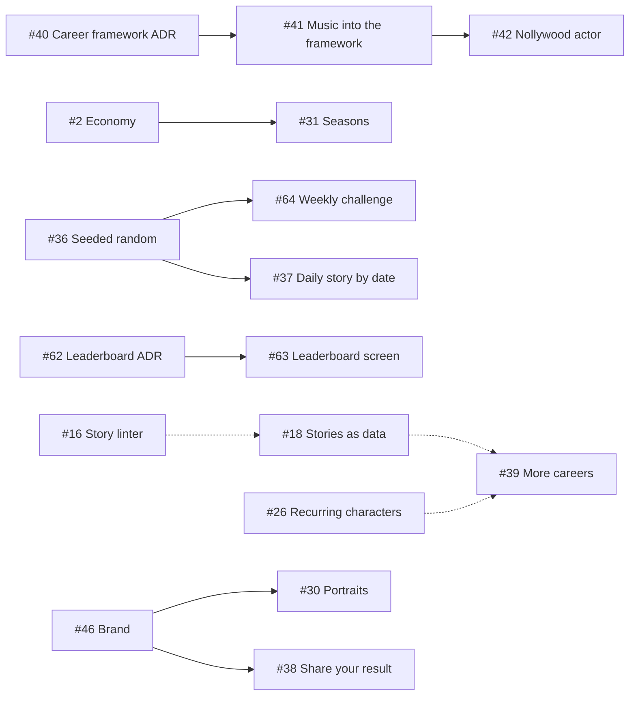

# Roadmap

The epics for The Next Lagos Star, in priority order. Each epic is a GitHub issue labelled `epic`, with its tasks as sub-issues. GitHub shows progress on each epic as sub-issues close.

All epics: [issues labelled `epic`](https://github.com/tiwadara/lagos-superstar/issues?q=is%3Aissue+label%3Aepic).

## Now

Changed on 6 October 2026. Another Lagos music game, Road to Number One, covers the musician's path, so careers beyond music moved to the front. See [#39](https://github.com/tiwadara/lagos-superstar/issues/39).

| Epic | Goal | Tasks |
| --- | --- | --- |
| [#39 More careers](https://github.com/tiwadara/lagos-superstar/issues/39) | A career choice on the first screen, starting with the Nollywood actor, in the same city with the same cast | [#40](https://github.com/tiwadara/lagos-superstar/issues/40) [#41](https://github.com/tiwadara/lagos-superstar/issues/41) [#42](https://github.com/tiwadara/lagos-superstar/issues/42) |
| [#7 Ready for players](https://github.com/tiwadara/lagos-superstar/issues/7) | Fix rough edges, accessibility, a clear next goal, and playtest feedback | [#11](https://github.com/tiwadara/lagos-superstar/issues/11) [#12](https://github.com/tiwadara/lagos-superstar/issues/12) [#13](https://github.com/tiwadara/lagos-superstar/issues/13) [#45](https://github.com/tiwadara/lagos-superstar/issues/45) [#59](https://github.com/tiwadara/lagos-superstar/issues/59) |
| [#2 Economy and balance](https://github.com/tiwadara/lagos-superstar/issues/2) | Keep money a real decision all game, and make taking every bag cost something | [#52](https://github.com/tiwadara/lagos-superstar/issues/52) |

## Next

| Epic | Goal | Tasks |
| --- | --- | --- |
| [#61 Leaderboard](https://github.com/tiwadara/lagos-superstar/issues/61) | Compare careers with everyone else, and a weekly challenge on a shared seed | [#62](https://github.com/tiwadara/lagos-superstar/issues/62) [#63](https://github.com/tiwadara/lagos-superstar/issues/63) [#64](https://github.com/tiwadara/lagos-superstar/issues/64) |
| [#46 Brand and visual identity](https://github.com/tiwadara/lagos-superstar/issues/46) | Its own brand that can grow beyond music, a design system, two signature animations, personal touches | [#47](https://github.com/tiwadara/lagos-superstar/issues/47) [#48](https://github.com/tiwadara/lagos-superstar/issues/48) [#49](https://github.com/tiwadara/lagos-superstar/issues/49) [#50](https://github.com/tiwadara/lagos-superstar/issues/50) [#60](https://github.com/tiwadara/lagos-superstar/issues/60) |
| [#22 Replay variety](https://github.com/tiwadara/lagos-superstar/issues/22) | More stories and follow-ups, drawn so each game feels different | [#23](https://github.com/tiwadara/lagos-superstar/issues/23) [#24](https://github.com/tiwadara/lagos-superstar/issues/24) [#25](https://github.com/tiwadara/lagos-superstar/issues/25) |
| [#18 Stories as data](https://github.com/tiwadara/lagos-superstar/issues/18) | Writers add stories in a data file without touching the rules | [#19](https://github.com/tiwadara/lagos-superstar/issues/19) [#20](https://github.com/tiwadara/lagos-superstar/issues/20) [#21](https://github.com/tiwadara/lagos-superstar/issues/21) |
| [#26 Recurring characters](https://github.com/tiwadara/lagos-superstar/issues/26) | A cast with faces and a memory of how you treated them | [#27](https://github.com/tiwadara/lagos-superstar/issues/27) [#28](https://github.com/tiwadara/lagos-superstar/issues/28) [#29](https://github.com/tiwadara/lagos-superstar/issues/29) [#30](https://github.com/tiwadara/lagos-superstar/issues/30) |

## Later

| Epic | Goal | Tasks |
| --- | --- | --- |
| [#31 Seasons](https://github.com/tiwadara/lagos-superstar/issues/31) | December becomes a yearly finale and the career carries on | [#32](https://github.com/tiwadara/lagos-superstar/issues/32) [#33](https://github.com/tiwadara/lagos-superstar/issues/33) [#34](https://github.com/tiwadara/lagos-superstar/issues/34) |
| [#35 Daily story](https://github.com/tiwadara/lagos-superstar/issues/35) | One story a day that every player gets, and a result to share | [#36](https://github.com/tiwadara/lagos-superstar/issues/36) [#37](https://github.com/tiwadara/lagos-superstar/issues/37) [#38](https://github.com/tiwadara/lagos-superstar/issues/38) |

Done: [#14 Checks on every pull request](https://github.com/tiwadara/lagos-superstar/issues/14).

## Dependencies

Solid arrows mean "needs first". Dotted arrows mean "helps".

## Decisions still to make

These tasks end in an ADR. See [docs/adr](adr/README.md).

| Task | Decision |
| --- | --- |
| [#40](https://github.com/tiwadara/lagos-superstar/issues/40) | Career framework: what is shared and what belongs to each career. Decided in [ADR 0008](adr/0008-careers-share-one-engine.md) |
| [#62](https://github.com/tiwadara/lagos-superstar/issues/62) | Where leaderboard scores live and how they stay honest. Proposed in [ADR 0013](adr/0013-leaderboard-on-netlify.md) |
| [#19](https://github.com/tiwadara/lagos-superstar/issues/19) | Data format for stories. Proposed in [ADR 0009](adr/0009-story-data-file.md) |
| [#47](https://github.com/tiwadara/lagos-superstar/issues/47) | Brand name, scope and visual direction. Proposed in [ADR 0011](adr/0011-brand-direction.md) |
| [#30](https://github.com/tiwadara/lagos-superstar/issues/30) | Portrait style for characters. Proposed in [ADR 0012](adr/0012-portraits-drawn-in-code.md) |
| [#32](https://github.com/tiwadara/lagos-superstar/issues/32) | What carries over between seasons. Proposed in [ADR 0010](adr/0010-seasons-carry-over.md) |

## Changing the roadmap

Open an issue with the Epic template, discuss it, and add it to this page in the same pull request that reorders anything. Keep "Now" to three epics at most.
